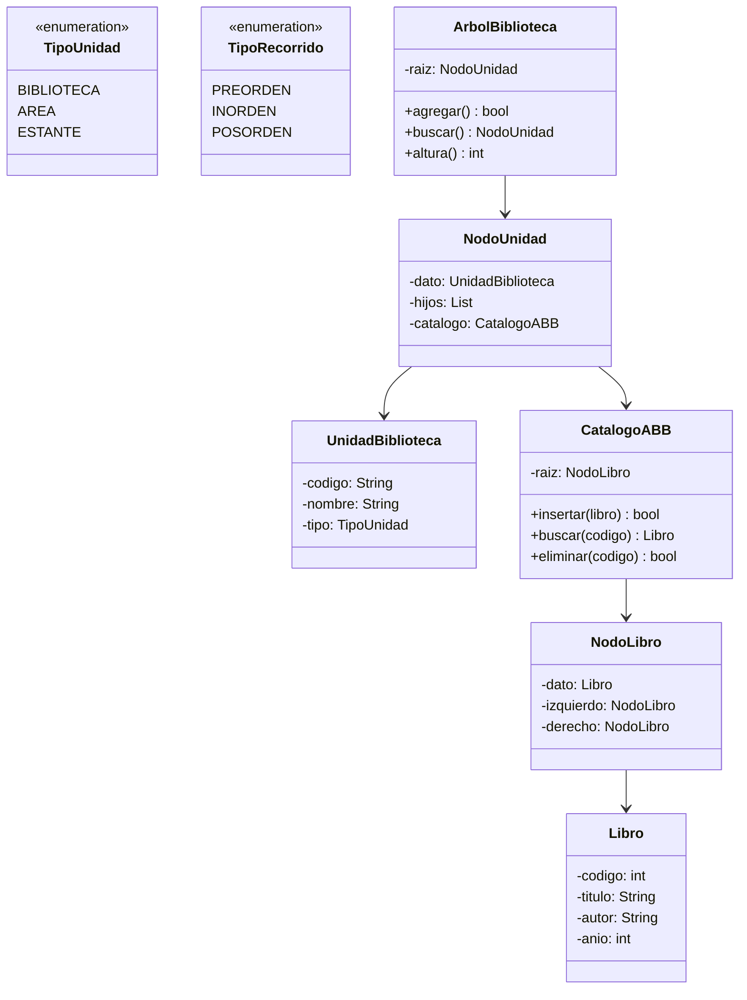

## Diagrama de Clases

```mermaid
classDiagram
    class TipoUnidad {
        <<enumeration>>
        BIBLIOTECA
        AREA
        ESTANTE
    }
    class TipoRecorrido {
        <<enumeration>>
        PREORDEN
        INORDEN
        POSORDEN
    }
    class Libro {
        -codigo: int
        -titulo: String
        -autor: String
        -anio: int
    }
    class UnidadBiblioteca {
        -codigo: String
        -nombre: String
        -tipo: TipoUnidad
    }
    class NodoLibro {
        -dato: Libro
        -izquierdo: NodoLibro
        -derecho: NodoLibro
    }
    class CatalogoABB {
        -raiz: NodoLibro
        +insertar(libro) bool
        +buscar(codigo) Libro
        +eliminar(codigo) bool
    }
    class NodoUnidad {
        -dato: UnidadBiblioteca
        -hijos: List
        -catalogo: CatalogoABB
    }
    class ArbolBiblioteca {
        -raiz: NodoUnidad
        +agregar() bool
        +buscar() NodoUnidad
        +altura() int
    }

    NodoUnidad --> UnidadBiblioteca
    NodoUnidad --> CatalogoABB
    NodoLibro --> Libro
    CatalogoABB --> NodoLibro
    ArbolBiblioteca --> NodoUnidad
```

